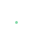

 
 

  <a href="https://source.network/">
    <picture>
      <source media="(prefers-color-scheme: dark)" srcset="../assets/source-logo-white.svg">
      <source media="(prefers-color-scheme: light)" srcset="../assets/source-logo-black.svg">
      
    </picture>
  </a>

 

  <picture>
    <source media="(prefers-color-scheme: dark)" srcset="../assets/tagline-dark.svg">
    <source media="(prefers-color-scheme: light)" srcset="../assets/tagline-light.svg">
    
  </picture>

  <a href="https://source.network"><picture><source media="(prefers-color-scheme: dark)" srcset="../assets/btn-website-dark.png"></picture></a><picture><source media="(prefers-color-scheme: dark)" srcset="../assets/btn-seperator-dark.png"></picture><a href="https://docs.source.network"><picture><source media="(prefers-color-scheme: dark)" srcset="../assets/btn-docs-dark.png"></picture></a>

  

  <a href="https://github.com/sourcenetwork/defradb"><picture><source media="(prefers-color-scheme: dark)" srcset="../assets/defradb-dark.png"></picture></a><a href="https://github.com/sourcenetwork/vera"><picture><source media="(prefers-color-scheme: dark)" srcset="../assets/vera-dark.png"></picture></a>

  <a href="https://github.com/sourcenetwork/lens"><picture><source media="(prefers-color-scheme: dark)" srcset="../assets/lensvm-dark.png"></picture></a><a href="https://github.com/sourcenetwork/orbis-rs"><picture><source media="(prefers-color-scheme: dark)" srcset="../assets/orbis-dark.png"></picture></a>

  

 

  <picture>
    <source media="(prefers-color-scheme: dark)" srcset="../assets/tagline-join-dark.svg">
    <source media="(prefers-color-scheme: light)" srcset="../assets/tagline-join-light.svg">
    
  </picture>

  <a href="https://discord.source.network"><picture><source media="(prefers-color-scheme: dark)" srcset="../assets/btn-discord-dark.png"></picture></a><picture><source media="(prefers-color-scheme: dark)" srcset="../assets/btn-seperator-dark.png"></picture><a href="https://x.com/edgeofsource"><picture><source media="(prefers-color-scheme: dark)" srcset="../assets/btn-x-dark.png"></picture></a>

